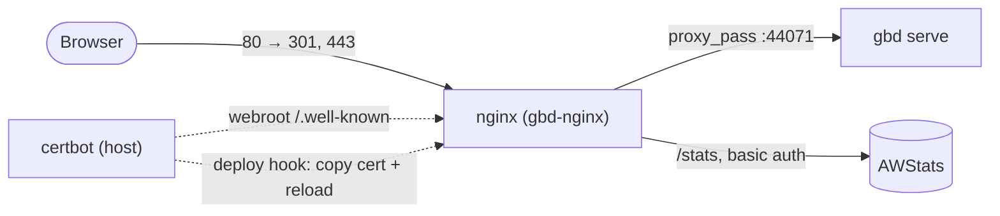

# GBD server - Docker deployment

Runs the GBD server (`gbd serve`) behind an nginx reverse proxy that terminates
TLS, serves AWStats access-log reports behind HTTP basic auth, and renews its
Let's Encrypt certificate automatically.



## Images

| Image | Built from | Contents |
| ----- | ---------- | -------- |
| `mygbd` | [Dockerfile.gbd](Dockerfile.gbd) | `gbd-tools` from PyPI; entrypoint `gbd serve` |
| `mynginx` | [Dockerfile.nginx](Dockerfile.nginx) | nginx + AWStats + [entrypoint.nginx.sh](entrypoint.nginx.sh) |

Both images are built locally (not pulled from a registry) via [build.sh](build.sh)
and referenced by name in [docker-compose.yml](docker-compose.yml).

## Host layout (`GBD_ROOT`)

Every host path in the compose file derives from a single variable,
`GBD_ROOT` (default `/home/iser`). Override it by exporting the variable before
running compose or any helper script; the built-in default keeps everything
working if you set nothing.

| Host path | Container mount | Purpose |
| --------- | --------------- | ------- |
| `$GBD_ROOT/gbd` | `/raid/gbd` (ro) | GBD database files listed in `GBD_DB` |
| `$GBD_ROOT/logs` | `/logs` (rw) | gbd server logs |
| `$GBD_ROOT/nginx/ssl` | `/etc/nginx/ssl` | `fullchain.pem` + `privkey.pem` |
| `$GBD_ROOT/nginx/ssl/bot` | `/etc/nginx/ssl/bot` | ACME webroot (`/.well-known`) |
| `$GBD_ROOT/nginx/awstats` | `/awstats` | AWStats database + access log (persisted) |
| `$GBD_ROOT/nginx/secrets/awstats.htpasswd` | docker secret `awstats_htpasswd` | AWStats basic-auth credentials |

Nothing sensitive lives in the repo: the AWStats secret and the TLS private key
sit under `GBD_ROOT`, outside the working tree, so the compose file and scripts
are safe to commit.

## Prerequisites

- Docker Engine with the **`docker compose`** (v2) plugin
- On the host: `certbot` and `openssl` (`htpasswd` from `apache2-utils` is used
  when present; otherwise `openssl` serves as the fallback)
- DNS `A`/`AAAA` records for `benchmark-database.de` and `www.benchmark-database.de`
  pointing at the server
- Inbound TCP **80** and **443** open

## Fresh setup

Run everything from this `docker/` directory.

```bash
# optional: export GBD_ROOT=/srv/gbd    # if not /home/iser

./setup_host.sh                 # create dirs, placeholder cert, check prerequisites
# copy your *.db files into $GBD_ROOT/gbd and adjust GBD_DB in docker-compose.yml
./setup_awstats.sh <username>   # create the AWStats basic-auth secret (prompts for a password)
./redeploy.sh                   # build both images and start the stack
```

nginx starts immediately using the self-signed placeholder cert. Now obtain the
real certificate (nginx serves the ACME challenge on port 80) and install it:

```bash
sudo certbot certonly --webroot -w "$GBD_ROOT/nginx/ssl/bot" \
     -d benchmark-database.de -d www.benchmark-database.de
sudo -E ./deploy-cert.sh        # copy the new cert into place and reload nginx
```

Finally, enable automatic renewal (see below).

## TLS renewal

Renewal is automatic and requires no manual steps once wired up:

1. Register the deploy hook so certbot runs it after every successful renewal:
   ```bash
   sudo ln -sf "$PWD/deploy-cert.sh" /etc/letsencrypt/renewal-hooks/deploy/gbd
   ```
2. Confirm certbot's renew timer is active:
   ```bash
   systemctl list-timers | grep -i certbot
   ```

`certbot renew` runs twice daily and renews ~30 days before expiry using the
webroot config saved at first issuance. On an actual renewal,
[deploy-cert.sh](deploy-cert.sh) copies the new certificate into
`$GBD_ROOT/nginx/ssl` and reloads nginx (`nginx -s reload`, zero downtime).

Test without hitting rate limits:

```bash
sudo certbot renew --dry-run          # verifies the webroot challenge
sudo -E ./deploy-cert.sh              # verifies copy + reload
```

> If you override `GBD_ROOT`, set the same value in certbot's environment (the
> timer runs with a bare root env), or edit the default in `deploy-cert.sh`.

## Updating / redeploying

On your workstation:

```bash
git add -A && git commit -m "…" && git push
```

On the server:

```bash
git pull
./redeploy.sh
```

`redeploy.sh` rebuilds both images (`--no-cache`, so the gbd image picks up the
latest published `gbd-tools`), recreates the containers whose image changed, and
prunes dangling images. Databases, AWStats data, and certificates persist across
rebuilds because they live in bind mounts under `GBD_ROOT`.

> **Migrating from a different run directory:** the stack now has a stable
> project name (`gbd`) and a fixed nginx container name (`gbd-nginx`). If you
> used to run compose from another directory, bring that old stack down first
> (`docker compose down` there) before the first `./redeploy.sh`, to avoid a
> duplicate gbd container clashing on port 44071.

## Helper scripts

| Script | Purpose |
| ------ | ------- |
| [setup_host.sh](setup_host.sh) | Create the `GBD_ROOT` directory skeleton, a placeholder cert, and check prerequisites |
| [setup_awstats.sh](setup_awstats.sh) | Create/replace the AWStats basic-auth secret (`<username>` arg, password prompted) |
| [redeploy.sh](redeploy.sh) | Rebuild both images and (re)start the stack |
| [deploy-cert.sh](deploy-cert.sh) | Certbot deploy hook: install renewed cert + reload nginx |
| [build.sh](build.sh) | Build a single image: `./build.sh nginx` or `./build.sh gbd` |

## Configuration reference

- **`GBD_ROOT`**: host root for all bind mounts and the secret (default `/home/iser`).
- **`GBD_DB`** (gbd service): colon-separated list of database files inside the
  container (`/raid/gbd/*.db`); each must exist under `$GBD_ROOT/gbd`.
- **`GBD_LOGS`** (gbd service): writable directory for the server log
  (`trfile.log`); set to `/logs`, backed by the `$GBD_ROOT/logs:/logs:rw` mount.
  Must not point inside the read-only `/raid/gbd` mount.
- **`VIRTUAL_HOST`** (nginx service): public hostname; substituted into the
  nginx config and used as the AWStats config name.

The domain `benchmark-database.de` is referenced in
[docker-compose.yml](docker-compose.yml) (`VIRTUAL_HOST`),
[deploy-cert.sh](deploy-cert.sh) (`domain`), [setup_host.sh](setup_host.sh)
(placeholder CN), and the `certbot certonly` command. Change it in all four when
deploying a different host.

## Troubleshooting

**502 Bad Gateway**: nginx is up but the `gbd` upstream isn't answering on
`:44071`. Inspect the gbd container:

```bash
docker compose ps                     # is gbd Up, or Restarting?
docker compose logs --tail=100 gbd
```

Common causes:

- `FileNotFoundError: .../trfile.log` in a restart loop: `GBD_LOGS` points at a
  directory that is missing or read-only. It must be a writable path that exists
  in the container; the compose file sets `GBD_LOGS=/logs`, backed by the
  `$GBD_ROOT/logs:/logs:rw` mount. Never point it inside `/raid/gbd` (read-only).
- Missing database files: every path in `GBD_DB` must exist under
  `$GBD_ROOT/gbd` (mounted read-only at `/raid/gbd`).
- Duplicate/old containers from a previous run directory holding port 44071:
  `docker compose down --remove-orphans` in the old location, then bring the
  stack up from here.
